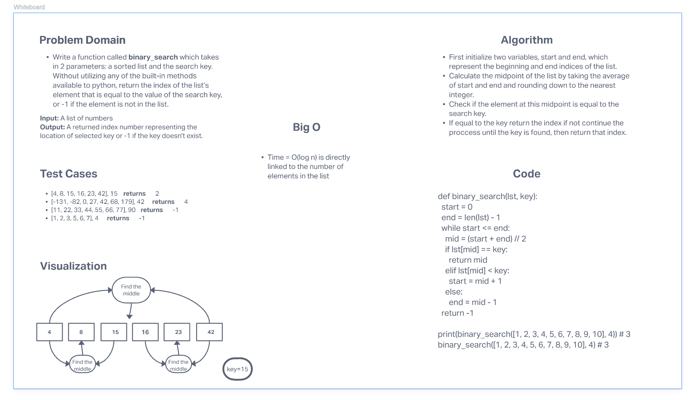

# Binary Search of Sorted Array
<!-- Description of the challenge -->
Write a function called binary_search which takes in 2 parameters: a sorted list and the search key. Without utilizing any of the built-in methods available to python, return the index of the list’s element that is equal to the value of the search key, or -1 if the element is not in the list.
## Whiteboard Process
<!-- Embedded whiteboard image -->

## Approach & Efficiency
<!-- What approach did you take? Discuss Why. What is the Big O space/time for this approach? -->
First initialize two variables, start and end, which represent the beginning and end indices of the list. Calculate the midpoint of the list by taking the average of start and end and rounding down to the nearest integer.
Check if the element at this midpoint is equal to the search key. If equal to the key return the index if not continue the process until the key is found, then return that index. Big O(log n) is directly linked to the number of elements in the list.
