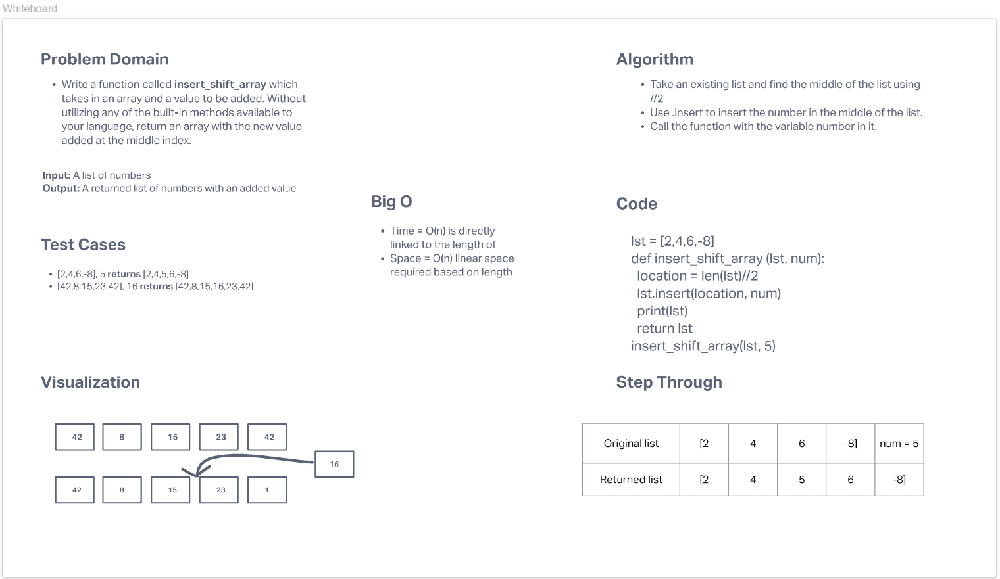

# Insert to Middle of an Array
<!-- Description of the challenge -->
Write a function called insert_shift_array which takes in an array and a value to be added. Without utilizing any of the built-in methods available to your language, return an array with the new value added at the middle index.

## Whiteboard Process
<!-- Embedded whiteboard image -->

## Approach & Efficiency
<!-- What approach did you take? Discuss Why. What is the Big O space/time for this approach? -->
I took an existing list and found the middle of the list using its length and //2. Then I used .insert to insert the number in the middle of the list. Lastly I called the function with the variable number passed in as an argument. Big O in this case is very efficient because the function only runs once. the function will be quick and only grow linear with the length of the list.
