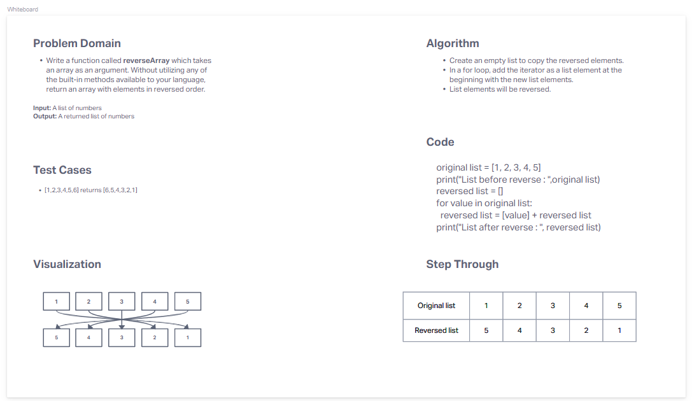

# Reverse an Array
<!-- Description of the challenge -->
Write a function called reverseArray which takes an array as an argument. Without utilizing any of the built-in methods available to your language, return an array with elements in reversed order.

## Whiteboard Process
<!-- embedded whiteboard image -->

## Approach and Efficiency
<!-- What approach did you take? Discuss Why. What is the Big O space/time for this approach? -->
I created a for loop in order to take an empty list and return the numbers from the original list in reverse. I used this approach because we couldn't use built in methods.
