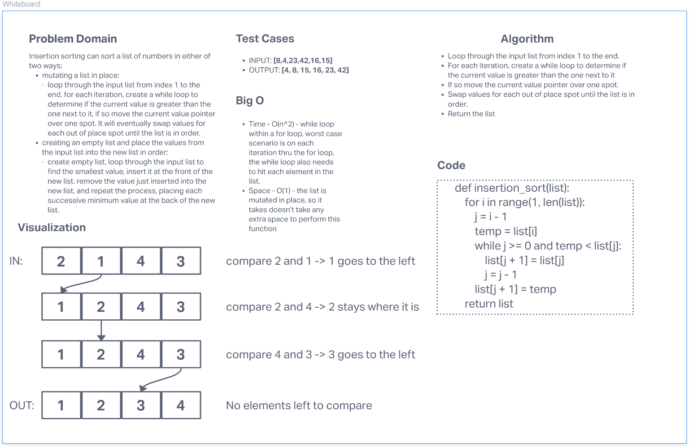

# Insertion Sort

Insertion sorting can sort a list of numbers in either of two ways:
  - mutating a list in place:
    - loop through the input list from index 1 to the end. for each iteration, create a while loop to determine if the current value is greater than the one next to it, if so move the current value pointer over one spot. It will eventually swap values for each out of place spot until the list is in order.
  - creating an empty list and place the values from the input list into the new list in order:
    - create empty list, loop through the input list to find the smallest value, insert it at the front of the new list. remove the value just inserted into the new list, and repeat the process, placing each successive minimum value at the back of the new list.

# Challenge Summary

Review the pseudocode below, then trace the algorithm by stepping through the process with the provided sample array. Create a whiteboard and code a working, tested implementation of Insertion Sort based on the pseudocode provided.

## Whiteboard Process

## Efficiency
#### Big O:
  - Time - O(n^2) - while loop within a for loop, worst case scenario is on each iteration through the for loop, the while loop also needs to hit each element in the list.
  - Space - O(1) - the list is mutated in place, so it takes doesn’t take any extra space to perform this function

## Solution

The solution code can be found here: [Solution Code](../../code_challenges/insertion_sort.py)
