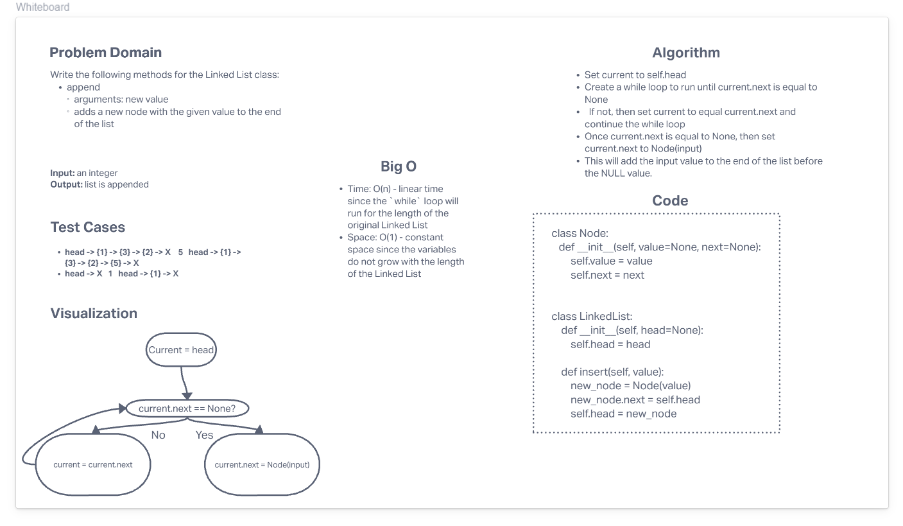

# Challenge Summary
<!-- Description of the challenge -->
In Python, a linked list is a linear data structure that is made up of a sequence of nodes, where each node stores a reference to an object and a reference to the next node in the sequence. Linked lists are used to store data in a dynamic way, as the number of nodes in a linked list can grow or shrink as needed. Each node in a linked list is typically implemented as a separate Python class, with instance variables to store the data and the reference to the next node. The linked list class itself typically contains a reference to the head (first) node in the list and possibly a reference to the tail (last) node as well.
## Whiteboard Process
<!-- Embedded whiteboard image -->

## Approach & Efficiency
<!-- What approach did you take? Why? What is the Big O space/time for this approach? -->

* Set `current` to `self.head`
* Create a `while` loop to run until `current.next` is equal to `None`
  * If not, then set `current` to equal `current.next` and continue the `while` loop
* Once `current.next` is equal to `None`, then set `current.next` to `Node(input)`
* This will add the input value to the end of the list before the `NULL` value.

Efficiency:
* Time: O(n) - linear time since the `while` loop will run for the length of the original Linked List
* Space: O(1) - constant space since the variables do not grow with the length of the Linked List
## Solution
<!-- Show how to run your code, and examples of it in action -->
The solution code is located in the `data_structures/linked_list.py` file.
