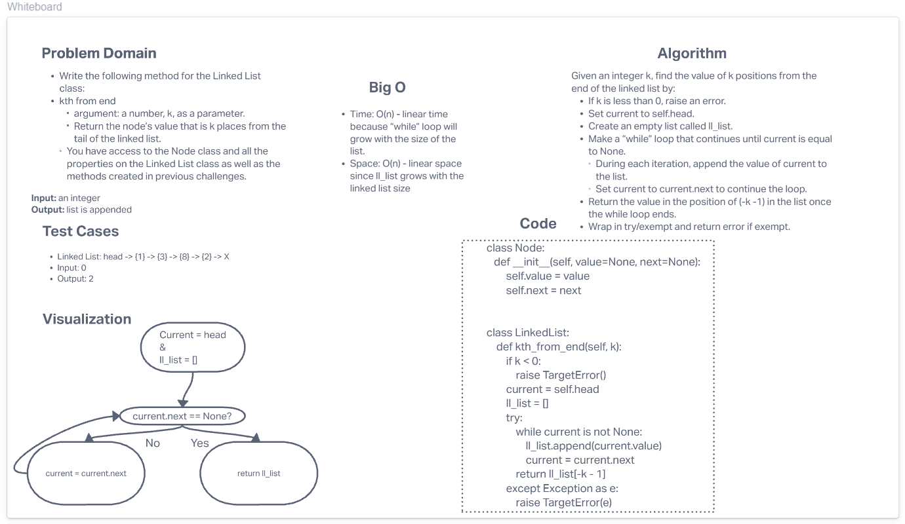

# Challenge Summary
<!-- Description of the challenge -->
Write the following method for the Linked List class:

- kth from end
    - argument: a number, k, as a parameter.
    - Return the node’s value that is k places from the tail of the linked list.
    - You have access to the Node class and all the properties on the Linked List class as well as the methods created in previous challenges.
## Whiteboard Process
<!-- Embedded whiteboard image -->

## Approach & Efficiency
<!-- What approach did you take? Why? What is the Big O space/time for this approach? -->
- Time: O(n) - linear time because “while” loop will grow with the size of the list.
- Space: O(n) - linear space since ll_list grows with the linked list size
## Solution
<!-- Show how to run your code, and examples of it in action -->
The solution code is located in the `data_structures/linked_list.py` file.
- Example 1:

  - Linked List: head -> {1} -> {3} -> {8} -> {2} -> X
  - Input: 0
  - Output: 2
- Example 2:

  - Linked List: head -> {1} -> {3} -> {8} -> {2} -> X
  - Input: 2
  - Output: 3
- Example 3:

  - Linked List: head -> {1} -> {3} -> {8} -> {2} -> X
  - Input: 6
  - Output: Exception
