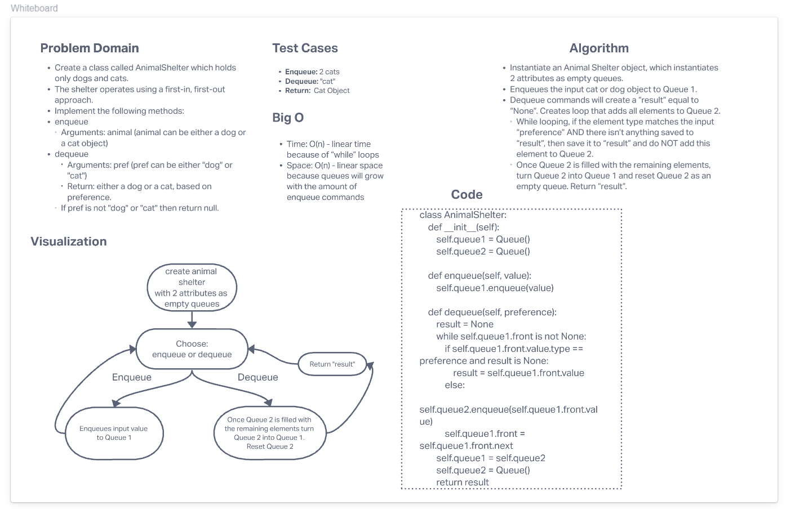

# Challenge Summary

- Create a class called AnimalShelter which holds only dogs and cats.
- The shelter operates using a first-in, first-out approach.
- Implement the following methods:
- enqueue
    -  Arguments: animal (animal can be either a dog or a cat object)
- dequeue
    -  Arguments: pref (pref can be either "dog" or "cat")
    -  Return: either a dog or a cat, based on preference.
    -  If pref is not "dog" or "cat" then return null.
## Whiteboard Process

## Approach & Efficiency
#### Approach
- Create a **AnimalShelter** class.
- Class creates two empty Queues.
- Enqueues the input cat or dog object to Queue 1.
- Dequeue commands will create a result equal to None. Creates loop that adds all elements to Queue 2.

#### Efficiency
- Time: O(n) - linear time because of “while” loops
- Space: O(n) - linear space because it will grow with number of commands
## Solution

- The solution code is located here: [Solution Code](../../code_challenges/stack_queue_animal_shelter.py)
