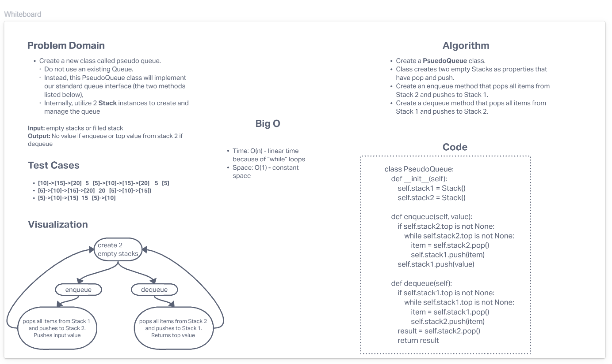

# Challenge Summary

- Create a new class called PseudoQueue.
  - Do not use an existing Queue.
  - Instead, this PseudoQueue class will implement our standard queue interface (the two methods listed below).
  - Internally, utilize 2 Stack instances to create and manage the queue
- Methods:
    -  enqueue
       -  Arguments: value
       - Inserts a value into the PseudoQueue, using a first-in, first-out approach.
    -  dequeue
       -  Arguments: none
       -  Extracts a value from the PseudoQueue, using a first-in, first-out approach.
## Whiteboard Process

## Approach & Efficiency
#### Approach
- Create a **PsuedoQueue** class.
- Class creates two empty Stacks as properties that have pop and push.
- Create an enqueue method that pops all items from Stack 2 and pushes to Stack 1.
- Create a dequeue method that pops all items from Stack 1 and pushes to Stack 2.

#### Efficiency
- Time: O(n) - linear time because of “while” loops
- Space: O(1) - constant space
## Solution

- The solution code is located here: [Solution Code](../../tests/code_challenges/test_stack_queue_pseudo.py)
