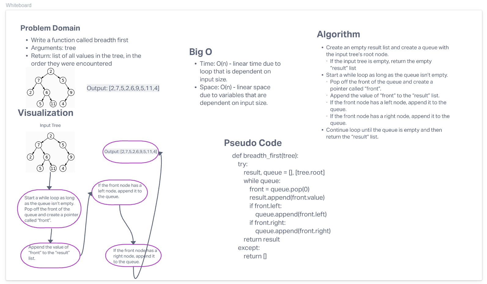

# Tree Breadth First
<!-- Description of the challenge -->
- Write a function called breadth first
- Arguments: tree
- Return: list of all values in the tree, in the order they were encountered
## Whiteboard Process
<!-- Embedded whiteboard image -->

## Approach & Efficiency
<!-- What approach did you take? Why? What is the Big O space/time for this approach? -->
- Time: O(n) - linear time due to loop that is dependent on input size.
- Space: O(n) - linear space due to variables that are dependent on input size.
## Solution
<!-- Show how to run your code, and examples of it in action -->
The solution code can be found here: [Solution Code](../../code_challenges/tree_breadth_first.py)
