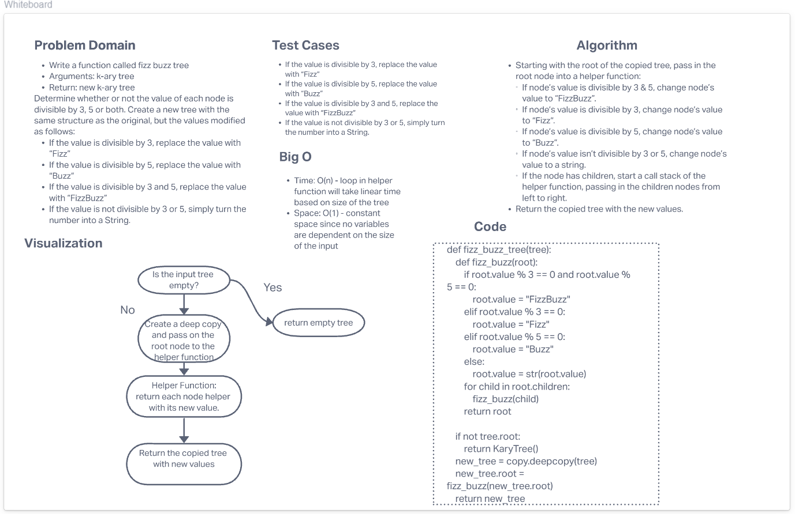

# Challenge Summary
<!-- Description of the challenge -->
### Feature Tasks
- Write a function called fizz buzz tree
- Arguments: k-ary tree
- Return: new k-ary tree

**Determine whether or not the value of each node is divisible by 3, 5 or both. Create a new tree with the same structure as the original, but the values modified as follows:**

- If the value is divisible by 3, replace the value with “Fizz”
- If the value is divisible by 5, replace the value with “Buzz”
- If the value is divisible by 3 and 5, replace the value with “FizzBuzz”
- If the value is not divisible by 3 or 5, simply turn the number into a String.
## Whiteboard Process
<!-- Embedded whiteboard image -->

## Approach & Efficiency
<!-- What approach did you take? Why? What is the Big O space/time for this approach? -->
- Starting with the root of the copied tree, pass in the root node into a helper function:
  - If node’s value is divisible by 3 & 5, change node’s value to “FizzBuzz”.
  - If node’s value is divisible by 3, change node’s value to “Fizz”.
  - If node’s value is divisible by 5, change node’s value to “Buzz”.
  - If node’s value isn’t divisible by 3 or 5, change node’s value to a string.
- Time: O(n) - loop in helper function will take linear time based on size of the tree
- Space: O(1) - constant space since no variables are dependent on the size of the input
## Solution
<!-- Show how to run your code, and examples of it in action -->
The solution code can be found here: [Solution Code](../../code_challenges/tree_fizz_buzz.py)
