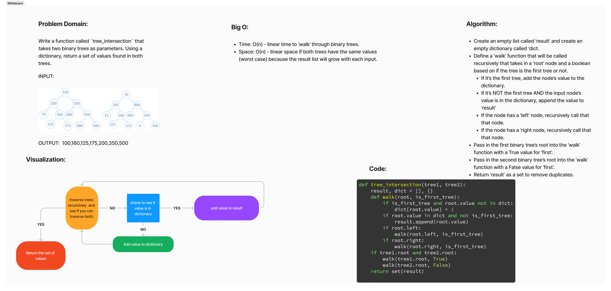

# Challenge Summary

* Write a function called `tree_intersection` that takes two binary trees as parameters. Using a dictionary, return a set of values found in both trees.

## Whiteboard Process

## Approach & Efficiency

Approach
* Create an empty list called ‘result’ and create an empty dictionary called ‘dict.
* Define a ‘walk’ function that will be called recursively that takes in a ‘root’ node and a boolean based on if the tree is the first tree or not.
  * If it’s the first tree, add the node’s value to the dictionary.
  * If it’s NOT the first tree AND the input node’s value is in the dictionary, append the value to ‘result’
  * If the node has a ‘left’ node, recursively call that that node.
  * If the node has a ‘right node, recursively call that that node.
* Pass in the first binary tree’s root into the ‘walk’ function with a True value for ‘first’.
* Pass in the second binary tree’s root into the ‘walk’ function with a False value for ‘first’.
* Return ‘result’ as a set to remove duplicates.

Efficiency
* Time: O(n) - linear time to ‘walk’ through binary trees.
* Space: O(n) - linear space if both trees have the same values (worst case) because the result list will grow with each input.

## Solution

The solution code can be found here: [Solution](../../code_challenges/tree_intersection.py)
